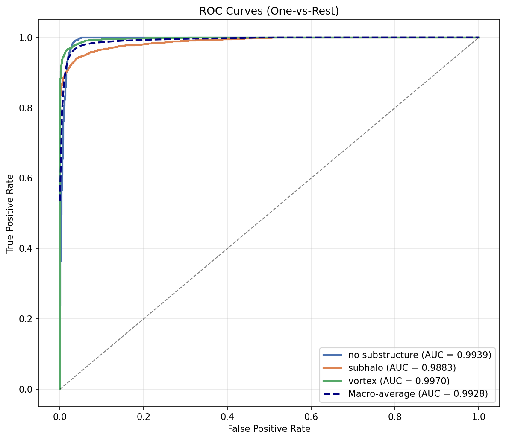
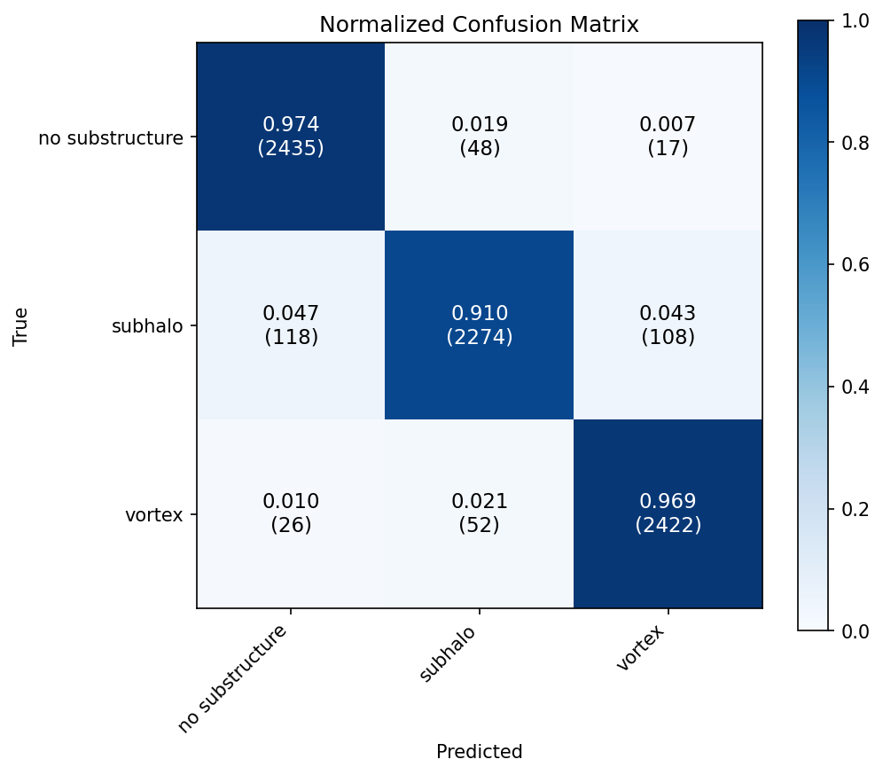
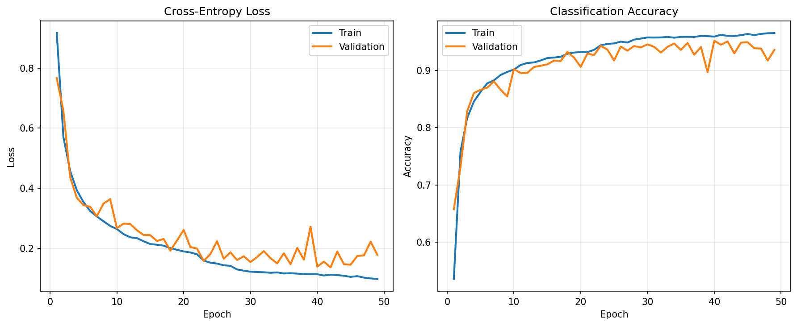
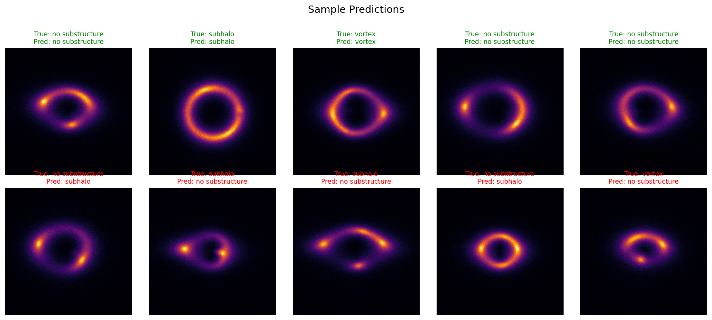
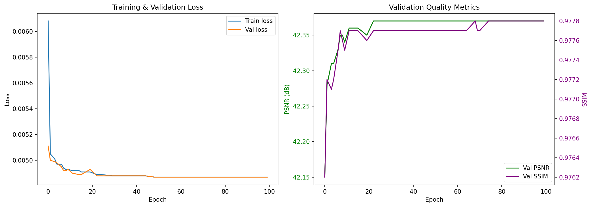
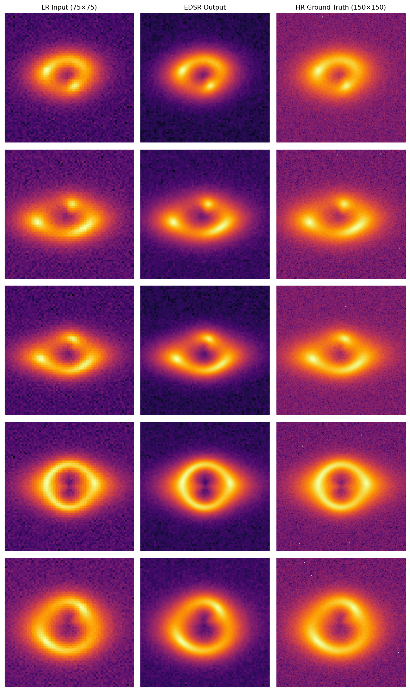
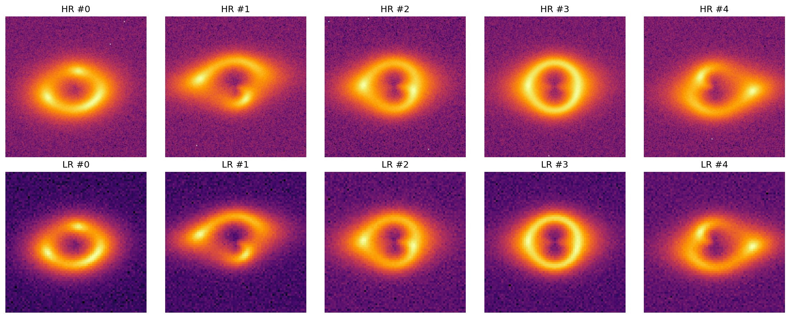
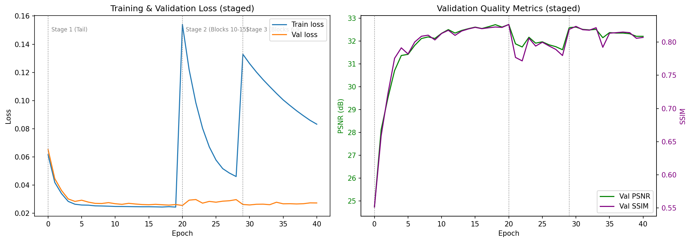
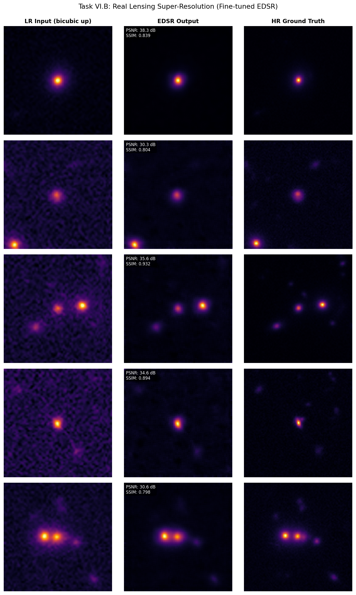

<p align="center">
  <h1 align="center">DEEPLENSE — GSoC 2026 Evaluation Tests</h1>
  <p align="center">
    <strong>Unsupervised Super-Resolution and Analysis of Real Lensing Images</strong><br>
    Organization: <a href="https://ml4sci.org/">ML4SCI</a> (Machine Learning for Science)<br>
    Mentors: Michael Toomey (MIT) &middot; Pranath Reddy &middot; Sergei Gleyzer
  </p>
</p>

---

**Author:** Rastin Aghighi | Queen's University | Computer Science + AI Minor
**GitHub:** [RastinAghighi](https://github.com/RastinAghighi) | **Email:** rastinaghighi@gmail.com

---

## Overview

This repository contains evaluation test solutions for the **DEEPLENSE** Google Summer of Code 2026 project under ML4SCI. Three tasks are addressed:

| Task | Description |
|------|-------------|
| **I** | Multi-class classification of gravitational lensing images (no substructure / subhalo / vortex) |
| **VI.A** | Supervised super-resolution on simulated strong lensing images using EDSR-baseline |
| **VI.B** | Transfer learning-based super-resolution on real HSC/HST telescope image pairs |

---

## Results

### Task I: Multi-Class Classification

- **Model:** ResNet-18 (ImageNet-pretrained, fine-tuned)
- **Validation Accuracy:** 94.8%

<p align="center">
  
  
</p>

<p align="center">
  
  
</p>

---

### Task VI.A: Simulated Super-Resolution

- **Model:** EDSR-baseline (16 residual blocks, 64 features, no batch normalization)
- **Loss:** Physics-informed composite (L1 + flux consistency + back-projection)
- **Scale:** 2x

| Method | PSNR (dB) | SSIM |
|--------|-----------|------|
| Bicubic | 41.61 | 0.9746 |
| EDSR | 42.37 | 0.9778 |
| EDSR+ (ensemble) | 42.37 | 0.9778 |

<p align="center">
  
  
</p>

<p align="center">
  
</p>

---

### Task VI.B: Real Telescope Super-Resolution

- **Transfer Learning:** 3-stage gradual unfreezing from VI.A pretrained weights
- **Regularization:** L2-SP (anchors weights near pretrained values to prevent catastrophic forgetting)
- **Scale:** 2x

| Method | PSNR (dB) | SSIM |
|--------|-----------|------|
| Bicubic | 20.73 | 0.3178 |
| Fine-tuned EDSR+ | 32.58 | 0.8257 |
| From-scratch EDSR+ | 32.72 | 0.8417 |

<p align="center">
  
  
</p>

---

## Architecture: EDSR-Baseline

The super-resolution backbone follows **EDSR-baseline** (Lim et al., CVPRW 2017):

- **No batch normalization** — BN normalizes feature magnitudes, which limits range flexibility needed for pixel-regression tasks. Removing BN also saves GPU memory.
- **Residual scaling** (factor 0.1) — prevents gradient explosion when stacking many residual blocks, stabilizing early training.
- **Global residual learning** — the network predicts only the high-frequency residual on top of a bicubic upsampling, letting the model focus capacity on fine detail recovery.
- **PixelShuffle upsampling** — learns a sub-pixel convolution for efficient, artifact-free 2x upscaling.

```
Input LR ──► [Head Conv] ──► 16x ResBlock ──► [Conv] ──► [PixelShuffle 2x] ──► [Tail Conv] ──► + ──► SR Output
                                                                                                 │
Input LR ──────────────────────────── Bicubic 2x ───────────────────────────────────────────────► ┘
```

---

## Composite Loss Function

The training objective is a physics-informed composite loss:

**L_total = L1(SR, HR) + lambda_flux * L_flux(SR, HR) + lambda_bp * L_bp(SR, LR)**

| Component | Purpose |
|-----------|---------|
| **L1 (MAE)** | Sharper reconstructions than L2, which over-smooths by penalizing large errors quadratically |
| **Flux Consistency** | Preserves total integrated intensity — gravitational lensing conserves photon flux, so the SR image must match HR total brightness |
| **Back-Projection** | Ensures the SR image is consistent with the LR observation when downsampled through the degradation model |

The back-projection term is particularly important for the unsupervised setting (Task VI.B), as it requires only knowledge of the degradation operator — not paired ground-truth data.

---

## Project Structure

```
DeepLense/
├── notebooks/
│   ├── Task_I_Classification.ipynb
│   ├── Task_VIA_SuperResolution_Simulated.ipynb
│   └── Task_VIB_SuperResolution_Real.ipynb
├── src/
│   ├── edsr.py              # EDSR-baseline model definition
│   ├── losses.py            # Composite loss + L2-SP regularizer
│   ├── dataset.py           # Dataset classes for all tasks
│   ├── metrics.py           # PSNR, SSIM evaluation
│   └── visualization.py     # Plotting utilities
├── figures/                 # Generated plots and visual comparisons
├── weights/                 # Trained model checkpoints (.pth)
├── results/                 # Evaluation metrics (JSON)
├── requirements.txt
└── README.md
```

---

## Setup

```bash
git clone https://github.com/RastinAghighi/DeepLense.git
cd DeepLense
pip install -r requirements.txt
```

**Requirements:** `torch`, `torchvision`, `numpy`, `matplotlib`, `scikit-image`, `scikit-learn`, `jupytext`

